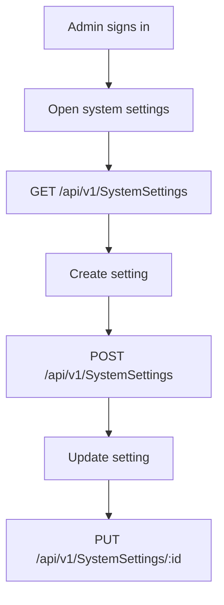
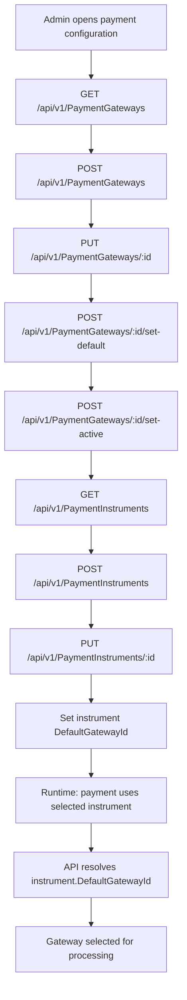
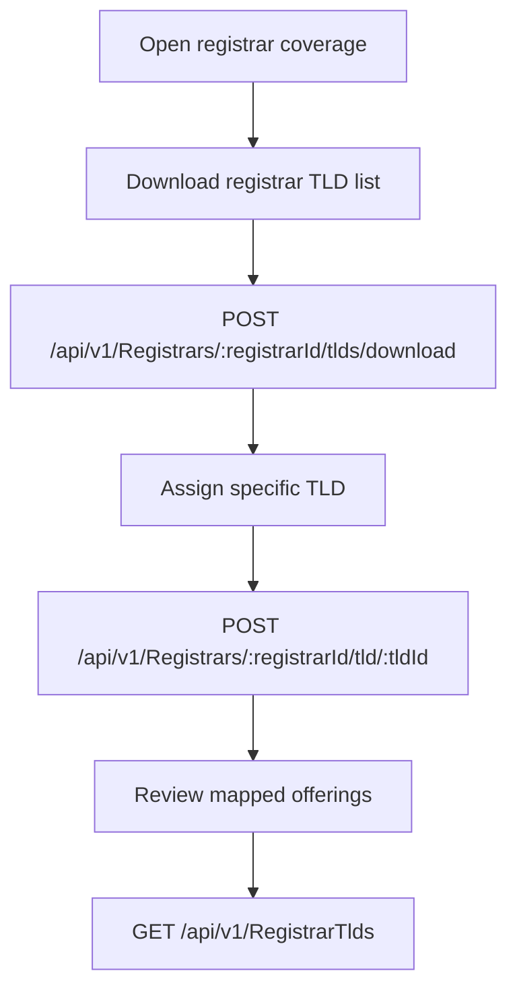
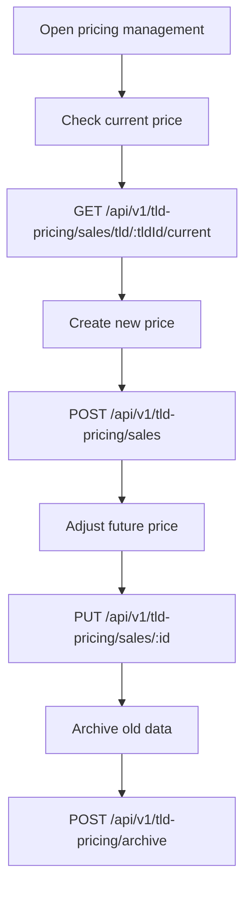

## Administrator configuration flow (catalog, pricing, payment routing)

### A) Global settings

### B) Payment gateways and instruments

### C) Registrar and TLD coverage

### D) Sales pricing setup

