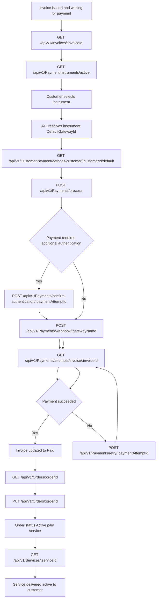

## Payment flow from invoice to paid service

### Endpoints included

- `GET /api/v1/Invoices/:invoiceId`
- `GET /api/v1/PaymentInstruments/active`
- `GET /api/v1/CustomerPaymentMethods/customer/:customerId/default`
- `POST /api/v1/Payments/process`
- `POST /api/v1/Payments/confirm-authentication/:paymentAttemptId`
- `POST /api/v1/Payments/webhook/:gatewayName`
- `GET /api/v1/Payments/attempts/invoice/:invoiceId`
- `POST /api/v1/Payments/retry/:paymentAttemptId`
- `GET /api/v1/Orders/:orderId`
- `PUT /api/v1/Orders/:orderId`
- `GET /api/v1/Services/:serviceId`
