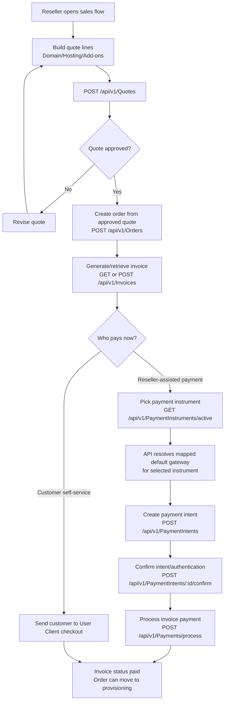

# Reseller Admin Client Flow (Quote to Payment)

```mermaid
flowchart TD
    A["Reseller opens sales flow"] --> B["Build quote lines<br/>Domain/Hosting/Add-ons"]
    B --> C["POST /api/v1/Quotes"]
    C --> D{Quote approved?}

    D -->|No| E["Revise quote"]
    E --> B

    D -->|Yes| F["Create order from approved quote<br/>POST /api/v1/Orders"]
    F --> G["Generate/retrieve invoice<br/>GET or POST /api/v1/Invoices"]
    G --> H{Who pays now?}

    H -->|Customer self-service| I["Send customer to User Client checkout"]
    H -->|Reseller-assisted payment| J["Pick payment instrument<br/>GET /api/v1/PaymentInstruments/active"]

    J --> K["API resolves mapped default gateway<br/>for selected instrument"]
    K --> L["Create payment intent<br/>POST /api/v1/PaymentIntents"]
    L --> M["Confirm intent/authentication<br/>POST /api/v1/PaymentIntents/:id/confirm"]
    M --> N["Process invoice payment<br/>POST /api/v1/Payments/process"]
    N --> O["Invoice status paid<br/>Order can move to provisioning"]

    I --> O
```
