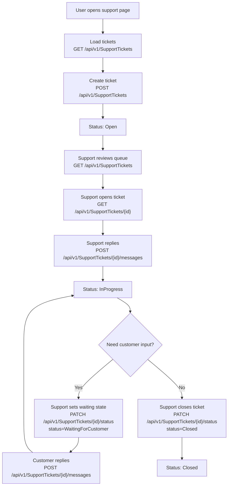

# Support Ticket and Sales Flow Diagrams

## Support Ticket Flow (User creates ticket to support closure)

```mermaid
flowchart TD
    A["User opens support page"] --> B["Load tickets\nGET /api/v1/SupportTickets"]
    B --> C["Create ticket\nPOST /api/v1/SupportTickets"]
    C --> D["Status: Open"]
    D --> E["Support reviews queue\nGET /api/v1/SupportTickets"]
    E --> F["Support opens ticket\nGET /api/v1/SupportTickets/{id}"]
    F --> G["Support replies\nPOST /api/v1/SupportTickets/{id}/messages"]
    G --> H["Status: InProgress"]
    H --> I{"Need customer input?"}

    I -->|Yes| J["Support sets waiting state\nPATCH /api/v1/SupportTickets/{id}/status\nstatus=WaitingForCustomer"]
    J --> K["Customer replies\nPOST /api/v1/SupportTickets/{id}/messages"]
    K --> H

    I -->|No| L["Support closes ticket\nPATCH /api/v1/SupportTickets/{id}/status\nstatus=Closed"]
    L --> M["Status: Closed"]
```

## 
