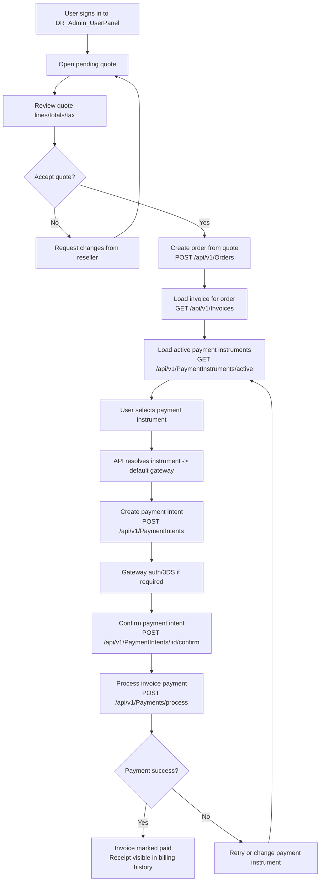

# DR Admin User Client Flow (Quote to Payment)

```mermaid
flowchart TD
    A["User signs in to DR_Admin_UserPanel"] --> B["Open pending quote"]
    B --> C["Review quote lines/totals/tax"]
    C --> D{Accept quote?}

    D -->|No| E["Request changes from reseller"]
    E --> B

    D -->|Yes| F["Create order from quote<br/>POST /api/v1/Orders"]
    F --> G["Load invoice for order<br/>GET /api/v1/Invoices"]
    G --> H["Load active payment instruments<br/>GET /api/v1/PaymentInstruments/active"]
    H --> I["User selects payment instrument"]
    I --> J["API resolves instrument -> default gateway"]
    J --> K["Create payment intent<br/>POST /api/v1/PaymentIntents"]
    K --> L["Gateway auth/3DS if required"]
    L --> M["Confirm payment intent<br/>POST /api/v1/PaymentIntents/:id/confirm"]
    M --> N["Process invoice payment<br/>POST /api/v1/Payments/process"]
    N --> O{Payment success?}

    O -->|Yes| P["Invoice marked paid<br/>Receipt visible in billing history"]
    O -->|No| Q["Retry or change payment instrument"]
    Q --> H
```
