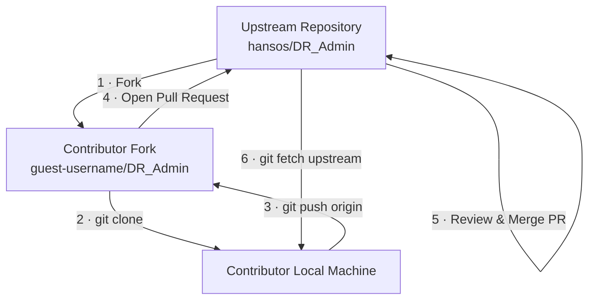
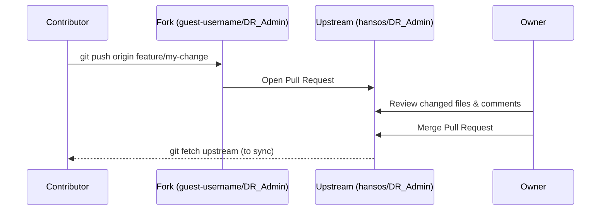

# Forking and Cloning DR_Admin

[Back to Index](index.md)

## Overview

This guide walks through the process of forking the DR_Admin repository on GitHub and cloning your fork to a local directory. This is the recommended way to obtain the source code for local development.

## Why Fork Instead of Clone Directly?

Forking creates your own copy of the repository under your GitHub account. This allows you to:

- Make changes without affecting the original repository.
- Submit pull requests back to the upstream repository when you want to contribute.
- Keep your fork in sync with upstream changes at your own pace.

## Prerequisites

- A [GitHub](https://github.com/) account.
- [Git](https://git-scm.com/downloads) installed on your local machine.
- (Optional) [GitHub CLI](https://cli.github.com/) for a streamlined workflow.

## Step 1 — Fork the Repository

1. Navigate to the upstream repository on GitHub:  
   **<https://github.com/hansos/DR_Admin>**
2. Click the **Fork** button in the upper-right corner of the page.
3. Select your personal account (or the target organisation) as the owner of the fork.
4. Leave the default settings and click **Create fork**.

After the fork is created you will have your own copy at:

```
https://github.com/<your-username>/DR_Admin
```

## Step 2 — Clone Your Fork Locally

Open a terminal and run:

```powershell
# Navigate to the directory where you want the project to live
cd C:\Source2

# Clone your fork
git clone https://github.com/<your-username>/DR_Admin.git

# Move into the cloned directory
cd DR_Admin
```

> **Tip:** Replace `<your-username>` with your actual GitHub username.

## Step 3 — Add the Upstream Remote

Adding the original repository as an upstream remote lets you pull future changes from the main project:

```powershell
git remote add upstream https://github.com/hansos/DR_Admin.git
```

Verify the remotes are set up correctly:

```powershell
git remote -v
```

Expected output:

```
origin    https://github.com/<your-username>/DR_Admin.git (fetch)
origin    https://github.com/<your-username>/DR_Admin.git (push)
upstream  https://github.com/hansos/DR_Admin.git (fetch)
upstream  https://github.com/hansos/DR_Admin.git (push)
```

## Step 4 — Keep Your Fork Up to Date

Periodically pull changes from the upstream repository to stay current:

```powershell
# Fetch upstream changes
git fetch upstream

# Switch to your local master branch
git checkout master

# Merge upstream changes into your local master
git merge upstream/master

# Push the updated master to your fork on GitHub
git push origin master
```

## Workflow Diagram



## How the Repository Owner Reviews and Merges Contributions

When a contributor (the "guest") pushes commits, those commits go to **their fork** — not to the upstream repository. The upstream repository is only updated when the owner explicitly merges those changes.

The standard way to move changes from a fork into the upstream repository is through a **Pull Request (PR)**.

### Where Pushes Go

| Actor        | `git push origin` sends to …                          |
| ------------ | ------------------------------------------------------ |
| Contributor  | `https://github.com/guest-username/DR_Admin` (fork)    |
| Owner        | `https://github.com/hansos/DR_Admin` (upstream)        |

The contributor **never** pushes directly to `hansos/DR_Admin`.

### Contributor — Opening a Pull Request

1. Push the feature branch to **their fork**:

   ```powershell
   git checkout -b feature/my-change
   # … make changes and commit …
   git push origin feature/my-change
   ```

2. On GitHub, navigate to the fork and click **Compare & pull request**.
3. Ensure the base repository is `hansos/DR_Admin` and the base branch is `master` (or the appropriate target branch).
4. Add a descriptive title and description, then click **Create pull request**.

### Owner — Reviewing and Merging

1. Navigate to the **Pull requests** tab on `https://github.com/hansos/DR_Admin`.
2. Open the contributor's PR to see the list of changed files and commits.
3. Review the code:
   - Use the **Files changed** tab to leave inline comments.
   - Request changes if something needs work, or approve if everything looks good.
4. Once satisfied, click **Merge pull request** (or choose *Squash and merge* / *Rebase and merge* as preferred).
5. The contributor's changes are now part of the upstream repository.

> **Tip — GitHub CLI shortcut:**
>
> ```powershell
> # List open PRs
> gh pr list --repo hansos/DR_Admin
>
> # Review a specific PR locally
> gh pr checkout <pr-number> --repo hansos/DR_Admin
>
> # Merge after review
> gh pr merge <pr-number> --repo hansos/DR_Admin --merge
> ```

### Pull Request Flow Diagram



## Importance for API Development

If you are developing solutions that consume the **DR_Admin API**, forking and maintaining a local copy of the repository is essential for the following reasons:

- **Access to API source & contracts** — The repository contains the API project, DTOs, and endpoint definitions. Having the source locally lets you inspect request/response models, understand validation rules, and review authentication requirements directly from the code rather than relying solely on external documentation.
- **Running the API locally** — A local clone allows you to spin up the API on your development machine, making it easy to test your integration against a live instance without depending on a remote environment.
- **Staying in sync with API changes** — By keeping your fork up to date with the upstream repository (see Step 4), you are immediately aware of breaking changes, new endpoints, or deprecated DTOs, giving you time to adapt your consuming applications before deploying.
- **Contributing fixes & improvements** — If you discover a bug or need an enhancement in the API while building your solution, your fork lets you make the change and submit a pull request back to the upstream project.

> **Recommendation:** Even if you are only consuming the API and not modifying the core DR_Admin code, maintaining an up-to-date fork ensures you always have a reliable local reference of the latest API contracts and can run integration tests against the real API codebase.
