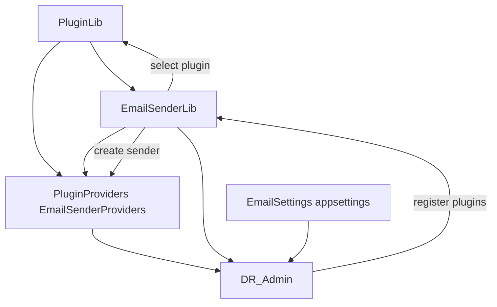

# Plugin Architecture: `PluginLib`, `PluginProviders`, and `EmailSenderProviders`

## Overview

The plugin model is split into three layers:

1. **Core plugin contracts (`PluginLib`)**
2. **Email plugin abstraction (`EmailSenderLib`)**
3. **Concrete provider implementations (`PluginProviders/EmailSenderProviders/*`)**

`DR_Admin` composes these at runtime using DI + configured plugin keys.

---

## 1) `PluginLib` (generic plugin infrastructure)

`PluginLib` is the base dependency for plugin selection across plugin types.

### Key responsibilities

- Defines common plugin contract:
  - `IPlugin` (key, display name, version, capabilities, enabled state, type)
- Defines plugin categories:
  - `PluginType` (`Email`, `Sms`, `PaymentGateway`)
- Provides selection infrastructure:
  - `PluginRegistry` (stores enabled plugins by type/key)
  - `PluginSelector` (chooses preferred plugin, then fallbacks)

### Position in dependency graph

- Referenced by `EmailSenderLib`
- Referenced by provider projects in `PluginProviders`

---

## 2) `EmailSenderLib` (email plugin abstraction layer)

`EmailSenderLib` builds email-specific abstractions on top of `PluginLib`.

### Key responsibilities

- Defines email plugin contract:
  - `IEmailSenderPlugin : IPlugin`
- Defines email plugin base class:
  - `EmailSenderPluginBase`
- Defines sender abstraction:
  - `IEmailSender`
- Defines settings and plugin selection options:
  - `EmailSettings`
  - `EmailPluginSelectionSettings`
- Provides runtime factory:
  - `EmailSenderFactory`

### How selection works

`EmailSenderFactory`:

1. receives all registered `IEmailSenderPlugin` from DI,
2. filters by `EnabledPluginKeys` / `DisabledPluginKeys`,
3. uses `PluginSelector` (`PluginLib`) to resolve preferred + fallback plugin,
4. creates concrete `IEmailSender` from selected plugin.

---

## 3) `PluginProviders/EmailSenderProviders/*` (concrete implementations)

Each provider project supplies one concrete plugin implementation.

Examples:

- `EmailSenderProvider.Smtp`
- `EmailSenderProvider.SendGrid`
- `EmailSenderProvider.Mailgun`
- `EmailSenderProvider.GraphApi`
- `EmailSenderProvider.Exchange`
- `EmailSenderProvider.MailKit`
- `EmailSenderProvider.AmazonSes`
- `EmailSenderProvider.Postmark`

### Common pattern in provider projects

- Project references:
  - `EmailSenderLib`
  - `PluginLib`
- Contains plugin class implementing email plugin contract (usually via `EmailSenderPluginBase`), e.g.:
  - `SmtpEmailSenderPlugin`
  - `SendGridEmailSenderPlugin`
- Plugin returns concrete `IEmailSender` implementation when settings are valid.

> Note: namespaces are `EmailSenderProviders.*`, while projects are under `PluginProviders/EmailSenderProviders/*`.

---

## Runtime composition in `DR_Admin`

`DR_Admin` references `EmailSenderLib` and all email provider projects in `DR_Admin.csproj`.

In `Program.cs`:

1. Reads `EmailSettings` from configuration.
2. Builds list of configured plugin keys.
3. Maps each key to provider plugin type name (reflection).
4. Registers each plugin as `IEmailSenderPlugin` in DI.
5. Registers `EmailSenderFactory`.

### Key mapping used in startup

- `smtp` -> `EmailSenderProvider.Smtp`
- `mailkit` -> `EmailSenderProvider.MailKit`
- `graphapi` -> `EmailSenderProvider.GraphApi`
- `exchange` -> `EmailSenderProvider.Exchange`
- `sendgrid` -> `EmailSenderProvider.SendGrid`
- `mailgun` -> `EmailSenderProvider.Mailgun`
- `amazonses` -> `EmailSenderProvider.AmazonSes`
- `postmark` -> `EmailSenderProvider.Postmark`

---

## Dependency summary

```text
PluginLib
   ↑
EmailSenderLib
   ↑
PluginProviders/EmailSenderProviders/*
   ↑
DR_Admin (runtime DI + configuration-based plugin selection)
```

## Library flow



This keeps plugin selection generic (`PluginLib`) while allowing channel-specific extension (`EmailSenderLib`) and provider-specific implementations (`EmailSenderProviders`).
