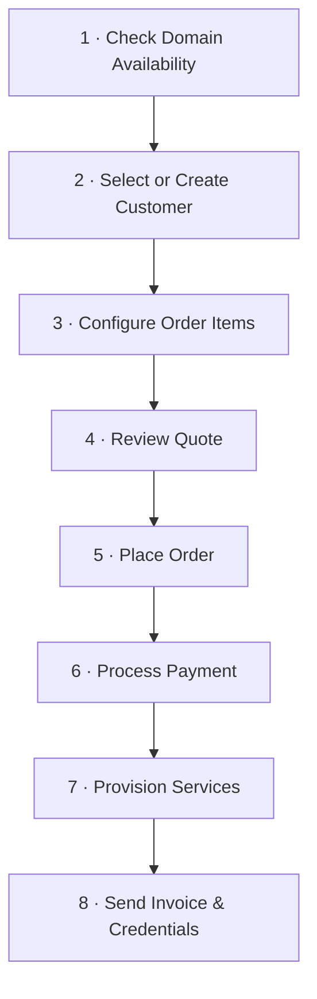
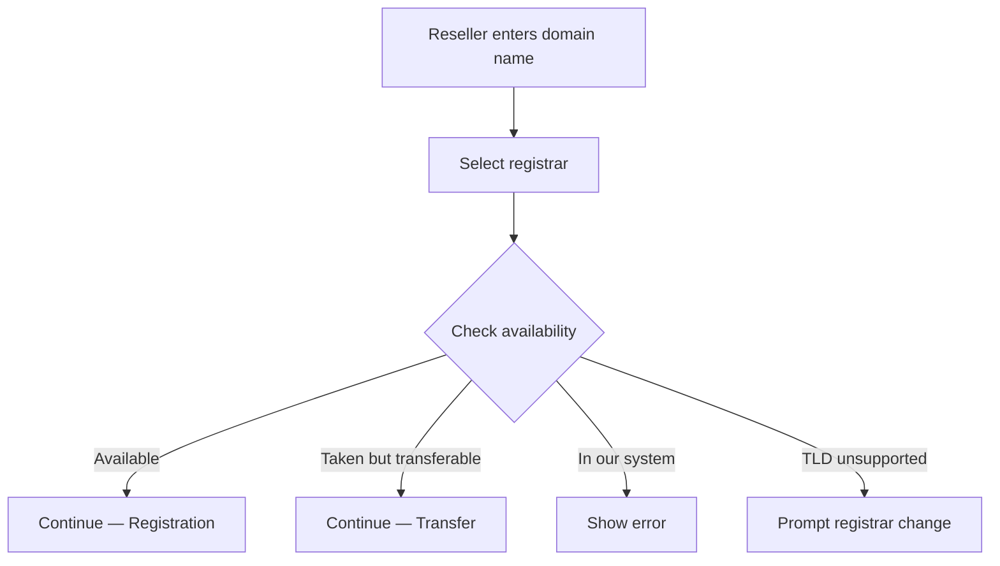
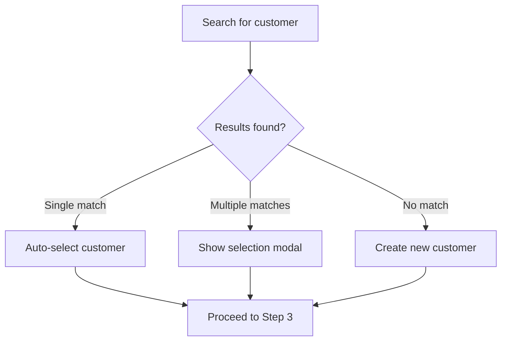
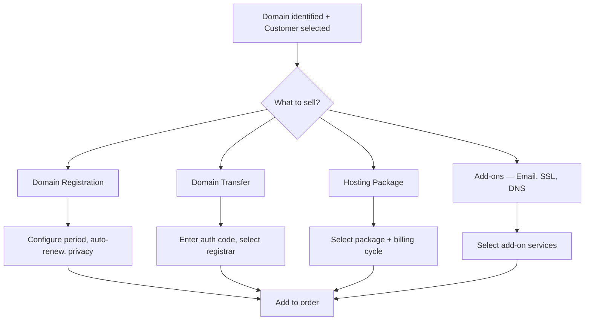
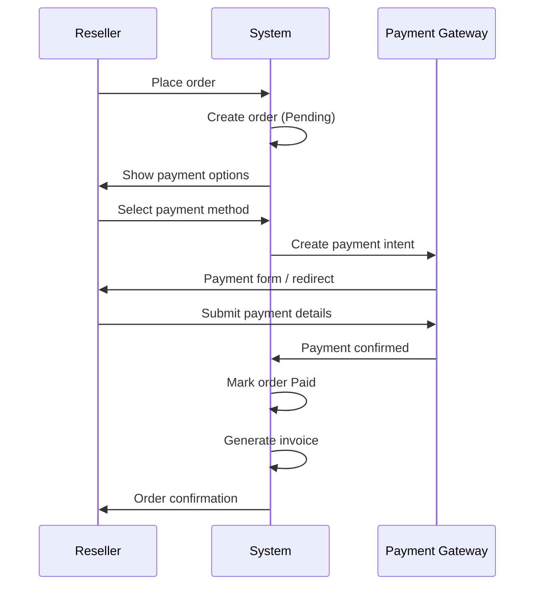
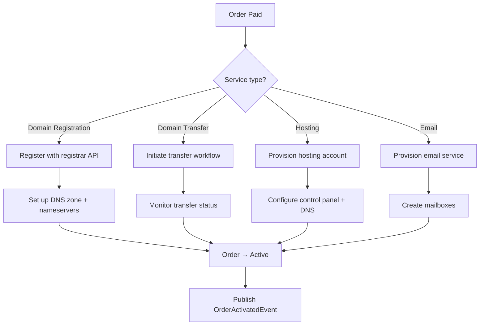
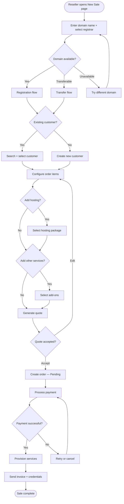

# Domain & Hosting Sales Workflow

This document describes the end-to-end workflow a reseller follows when selling domain registrations, domain transfers, and hosting packages to customers through the Reseller Panel.

---

## Overview

The sales process is a linear, step-by-step flow. Each step must complete before proceeding to the next. The reseller starts by checking domain availability, identifies or creates a customer, configures the order (domain and/or hosting), reviews a quote, and finalises the sale.

---

## Step 1 — Check Domain Availability

The reseller enters a domain name and selects a registrar. The system checks availability via the registrar API (`DomainManagerService.CheckDomainAvailabilityByNameAsync`) and queries the internal database through `RegisteredDomainService` to confirm the domain is not already managed.

### Possible outcomes

| Result                                      | Next Action                                     |
| ------------------------------------------- | ----------------------------------------------- |
| Available for registration                  | Proceed to Step 2 — **Registration** flow       |
| Already registered elsewhere (transferable) | Proceed to Step 2 — **Transfer** flow           |
| Already in our system                       | Show error — domain cannot be sold again        |
| TLD not supported by selected registrar     | Prompt reseller to choose a different registrar |

The availability response includes pricing, premium status, and suggested alternatives when the exact domain is taken.

---

## Step 2 — Select or Create Customer

Once a domain and flow type (registration or transfer) are determined, the reseller must associate the sale with a customer.

### Existing Customer

The reseller searches by name, email, phone, reference number, or customer number. The search uses `ICustomerService.SearchCustomersAsync`, which performs a free-text query across all customer and contact-person fields. When multiple results match, a selection modal is displayed.

### New Customer

If no matching customer exists the reseller clicks **Create Customer** and fills in the required fields. The customer is created via `ICustomerService.CreateCustomerAsync`. A `CustomerNumber` is assigned later during order finalisation through `EnsureCustomerNumberAsync` — only customers with at least one completed sale receive a number.

---

## Step 3 — Configure Order Items

With a customer selected and a domain identified the reseller configures what is being sold. A single sale can include multiple items.

### 3a · Domain Registration

Applicable when the domain is available. The reseller configures:

- **Registration period** — 1 to 10 years
- **Auto-renew** preference
- **Privacy protection** (WHOIS guard)
- **Registrar** — pre-selected from Step 1

Pricing is resolved from `DomainPricingDto` based on TLD and registrar. Contact details (Registrant, Admin, Tech, Billing) are populated from the customer record.

### 3b · Domain Transfer

Applicable when the customer owns a domain registered at another registrar. The reseller provides:

- **Authorisation / EPP code** obtained from the current registrar
- **Target registrar** in our system
- **Auto-renew** and **privacy protection** preferences

The system validates the auth code and initiates the transfer through the registrar API. Transfers are asynchronous — the domain enters a **Transfer Pending** state and is confirmed once the losing registrar approves.

### 3c · Hosting Package Selection

Optionally the reseller adds a hosting package to the same order. Available packages are loaded via `IHostingPackageService.GetActiveHostingPackagesAsync`. Each package defines:

| Attribute      | Description                          |
| -------------- | ------------------------------------ |
| Disk space     | Storage quota in MB                  |
| Bandwidth      | Monthly transfer quota in MB         |
| Email accounts | Number of mailboxes included         |
| Databases      | Number of databases allowed          |
| Domains        | Number of domains that can be hosted |
| Subdomains     | Number of subdomains allowed         |

The reseller selects a package and a billing cycle (monthly, yearly, etc.) retrieved from the Billing Cycles API.

### 3d · Additional Add-ons

Other items that may be bundled into the order:

- **Email hosting** — standalone or bundled with a hosting package
- **SSL certificates**
- **DNS zone packages**
- **Custom services** — consulting, migration assistance

---

## Step 4 — Review Quote

Before placing the order a quote is generated summarising all line items, pricing, taxes, and totals. The quote is created via `IQuoteService.CreateQuoteAsync`.

The quote includes:

- Customer information
- All line items with unit price, quantity, and subtotal
- Applicable tax rules
- Setup fees (one-time) versus recurring amounts
- Coupon or discount codes if applicable
- Quote validity period

The reseller can:

| Action                  | Effect                                      |
| ----------------------- | ------------------------------------------- |
| **Edit**                | Return to Step 3 and change items           |
| **Send to customer**    | Email the quote for the customer's approval |
| **Accept and continue** | Proceed directly to order placement         |

---

## Step 5 — Place Order

Once the quote is accepted the order is created via `IOrderService.CreateOrderAsync`. The order captures:

- `CustomerId`, `ServiceId`, `OrderType`
- `SetupFee`, `RecurringAmount`
- `StartDate`, `EndDate`, `NextBillingDate`
- `AutoRenew` flag
- Reference to the originating `QuoteId`

The order is created in **Pending** status. `EnsureCustomerNumberAsync` is called here to assign a customer number if this is the customer's first purchase.

---

## Step 6 — Process Payment

Payment is handled through the configured payment gateway.

1. Retrieve available gateways (`GET /api/v1/PaymentGateways`)
2. Create a payment intent with the order amount and currency
3. Collect payment details via the gateway's client SDK (card, bank transfer, etc.)
4. Complete any required authentication (3D Secure, etc.)
5. Confirm payment — the order transitions from **Pending** to **Paid**

An invoice is generated and finalised once payment is confirmed.

---

## Step 7 — Provision Services

After payment the `OrderProvisioningWorkflow` inspects the order's service type and delegates to the appropriate provisioning path.

| Service Type            | Provisioning Action                                                        |
| ----------------------- | -------------------------------------------------------------------------- |
| **Domain Registration** | Register domain with registrar API, set up DNS zone, configure nameservers |
| **Domain Transfer**     | Initiate transfer with registrar, monitor transfer status until complete   |
| **Hosting**             | Create hosting account, set up control panel access, configure DNS records |
| **Email**               | Create mailboxes, configure SMTP/IMAP access                               |

The order transitions to **Active** via the `OrderStateMachine` and an `OrderActivatedEvent` is published for downstream processing (notifications, audit log).

---

## Step 8 — Send Invoice & Credentials

Once provisioning completes:

1. The finalised **invoice** is emailed to the customer
2. **Service credentials** are sent (hosting login, email passwords, control panel URL)
3. A **welcome email** summarises everything purchased and how to get started
4. Recurring billing entries are created if the order includes subscriptions

---

## Complete End-to-End Flow

---

## Error Handling & Edge Cases

| Scenario                                     | Handling                                                                                              |
| -------------------------------------------- | ----------------------------------------------------------------------------------------------------- |
| Registrar API unavailable                    | Show error, allow retry. Do not create the order until availability is confirmed.                     |
| Domain transfer rejected by losing registrar | Keep order in **Transfer Pending**. Notify reseller. Allow re-initiation with a corrected auth code.  |
| Payment fails                                | Order remains **Pending**. Reseller can retry with a different method or cancel.                      |
| Customer already owns the domain             | Block duplicate registration. Show existing domain record.                                            |
| Provisioning failure after payment           | Order moves to **Provisioning Failed**. Trigger alert for manual intervention. Refund flow available. |
| Quote expires                                | Quote marked **Expired**. Reseller must create a new quote with refreshed pricing.                    |

---

## API Endpoints Referenced

| Endpoint                                        | Purpose                                 |
| ----------------------------------------------- | --------------------------------------- |
| `GET /api/v1/Customers`                         | Search / list customers                 |
| `POST /api/v1/Customers`                        | Create a new customer                   |
| `POST /api/v1/DomainManager/check-availability` | Check domain availability via registrar |
| `GET /api/v1/HostingPackages`                   | List active hosting packages            |
| `GET /api/v1/BillingCycles`                     | Retrieve billing cycle options          |
| `POST /api/v1/Quotes`                           | Create a draft quote                    |
| `POST /api/v1/Orders`                           | Create an order from an accepted quote  |
| `POST /api/v1/PaymentIntents`                   | Initiate payment                        |
| `POST /api/v1/Invoices/{id}/send`               | Send finalised invoice to customer      |
| `GET /api/v1/Currencies`                        | Retrieve available currencies           |
| `GET /api/v1/TaxRules`                          | Retrieve applicable tax rules           |

---

## Internal Services Referenced

| Service                     | Role in workflow                                               |
| --------------------------- | -------------------------------------------------------------- |
| `DomainManagerService`      | Domain availability checks and registration via registrar APIs |
| `RegisteredDomainService`   | Internal domain lookup, pricing, and duplicate detection       |
| `CustomerService`           | Customer CRUD, search, and customer-number assignment          |
| `HostingPackageService`     | Hosting package listing and selection                          |
| `QuoteService`              | Quote creation, update, and status management                  |
| `OrderService`              | Order creation and lifecycle management                        |
| `OrderProvisioningWorkflow` | Post-payment service provisioning orchestration                |
| `OrderStateMachine`         | Order status transitions (Pending → Paid → Active)             |
