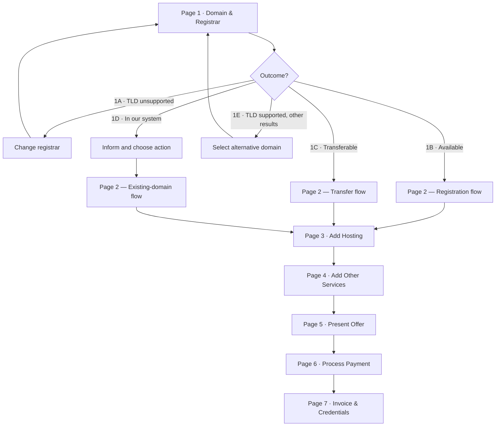
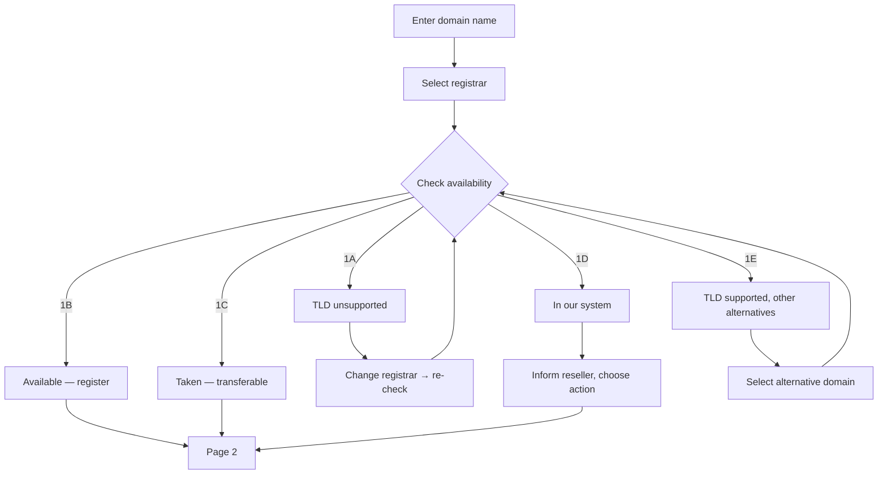
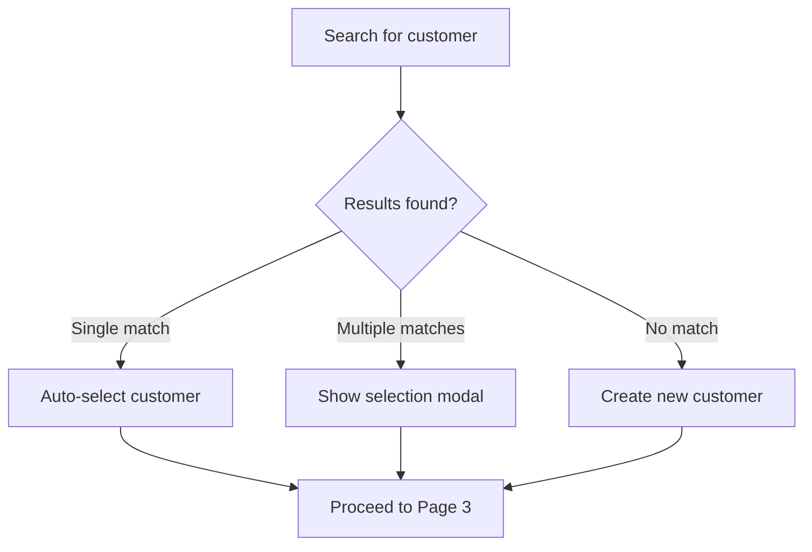
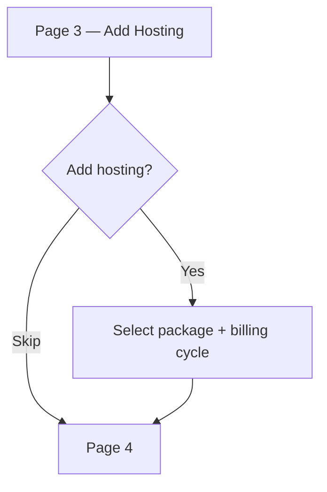
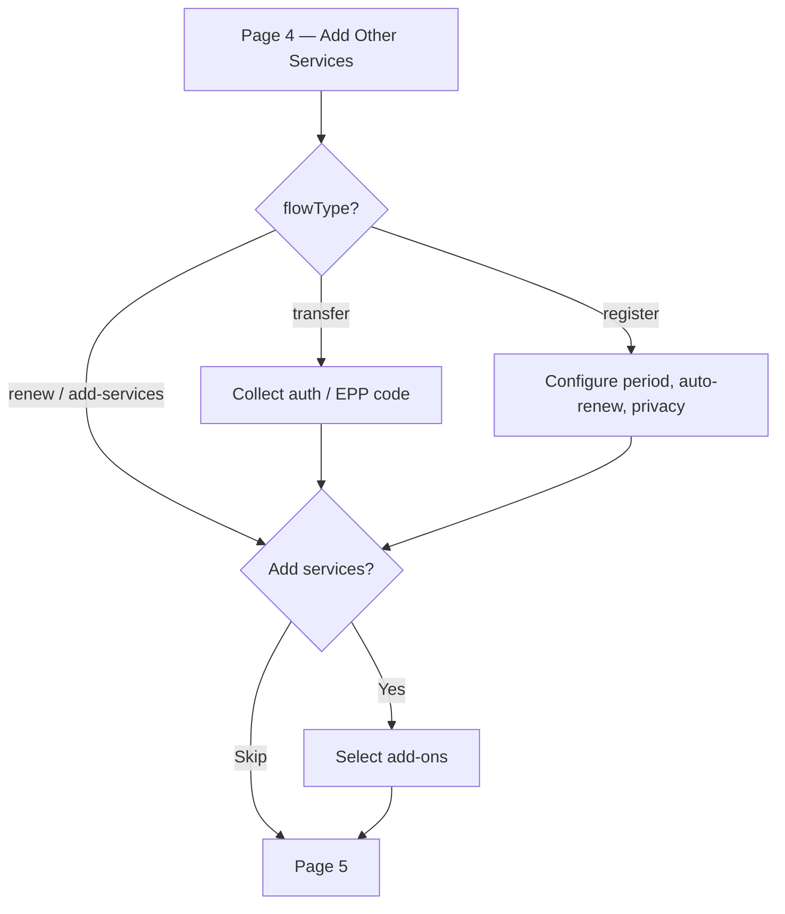
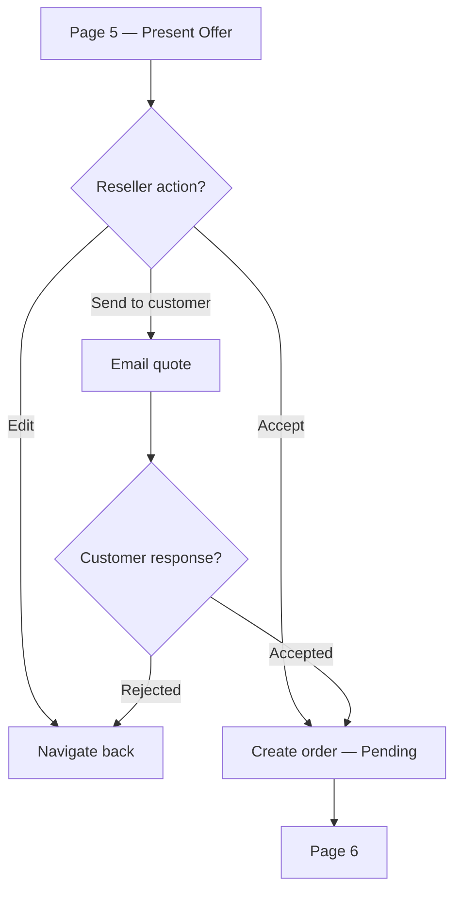
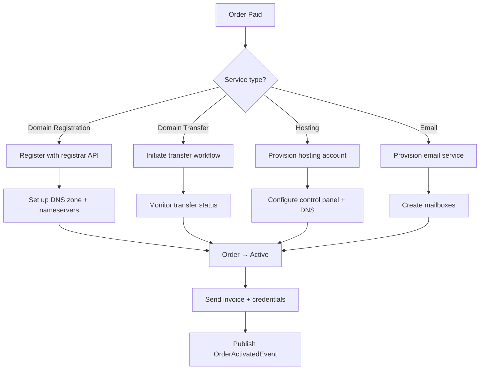
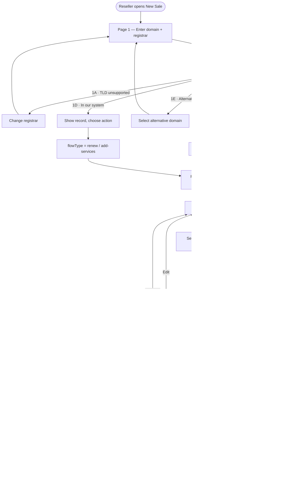

# Domain & Hosting Sales Workflow

This document describes the end-to-end workflow a reseller follows when selling domain registrations, domain transfers, and hosting packages to customers through the Reseller Panel.

---

## Overview

The sales process is split across seven pages. Each page handles one concern and must complete before the reseller can proceed. Page 1 determines what is being sold and how (registration, transfer, or existing-domain action) through a set of sub-outcomes. Pages 2–4 build the order. Page 5 presents the offer. Pages 6–7 handle payment, provisioning, and delivery.



### Page mapPAge

| Page | Route                          | Responsibility                                                                  |
| ---- | ------------------------------ | ------------------------------------------------------------------------------- |
| 1    | `/dashboard/new-sale`          | Domain name input, registrar selection, availability check, sub-outcome routing |
| 2    | `/dashboard/new-sale/customer` | Search / create customer, associate with sale                                   |
| 3    | `/dashboard/new-sale/hosting`  | Optional hosting package and billing cycle                                      |
| 4    | `/dashboard/new-sale/services` | Optional add-ons (email, SSL, DNS, custom)                                      |
| 5    | `/dashboard/new-sale/offer`    | Quote summary, send to customer or accept                                       |
| 6    | `/dashboard/new-sale/payment`  | Payment gateway selection and processing                                        |
| 7    | `/dashboard/new-sale/complete` | Provisioning status, invoice delivery, credentials                              |

---

## Page 1 — Domain & Registrar

The reseller enters a domain name and selects a registrar. The system checks availability via the registrar API (`DomainManagerService.CheckDomainAvailabilityByNameAsync`) and queries the internal database through `RegisteredDomainService` to confirm the domain is not already managed. The result determines which sub-outcome is shown.



### 1A — TLD unsupported

The selected registrar does not support the TLD. The reseller is prompted to choose a different registrar. The page stays on Page 1 and re-runs the availability check after the change.

### 1B — Available for registration

The domain is available. The availability response includes pricing and premium status. The reseller clicks **Register domain** and proceeds to Page 2 with `flowType = register`.

### 1C — Taken but transferable

The domain is registered at another registrar but can be transferred. The reseller clicks **Transfer domain** and proceeds to Page 2 with `flowType = transfer`. The transfer flow will require an authorisation / EPP code on a later page.

### 1D — Already in our system

The domain is already managed internally. The system shows the existing domain record (owner, status, expiry). The reseller is presented with options appropriate to the situation:

- **Renew** — extend the registration period
- **Add services** — attach hosting or other products to the existing domain
- **Contact owner** — if the domain belongs to a different customer

The chosen action determines the `flowType` passed to Page 2.

### 1E — TLD supported, select alternative

The exact domain is not available but the TLD is supported. The system returns suggested alternatives (different TLDs or name variations). The reseller can select an alternative and re-run the check, or enter a new domain name entirely. The page stays on Page 1 until a domain is confirmed.

### State handoff

When leaving Page 1 the following state is saved to `sessionStorage` under the key `new-sale-state`:

```json
{
  "domainName": "example.com",
  "selectedRegistrarId": "3",
  "selectedRegistrarLabel": "Namecheap (namecheap)",
  "flowType": "register | transfer | renew | add-services",
  "pricing": { "registration": 12.99, "currency": "EUR" }
}
```

---

## Page 2 — Select or Create Customer

The reseller must associate the sale with a customer. The `flowType` from Page 1 is displayed as context (e.g. “Registering example.com” or “Transferring example.com”).

### Existing Customer

The reseller searches by name, email, phone, reference number, or customer number. The search uses `ICustomerService.SearchCustomersAsync`, which performs a free-text query across all customer and contact-person fields. When multiple results match, a selection modal is displayed.

### New Customer

If no matching customer exists the reseller clicks **Create Customer** and fills in the required fields. The customer is created via `ICustomerService.CreateCustomerAsync`. A `CustomerNumber` is assigned later during order finalisation through `EnsureCustomerNumberAsync` — only customers with at least one completed sale receive a number.



---

## Page 3 — Add Hosting

The reseller optionally adds a hosting package to the order. This page is always shown but can be skipped.

Available packages are loaded via `IHostingPackageService.GetActiveHostingPackagesAsync`. Each package defines:

| Attribute      | Description                          |
| -------------- | ------------------------------------ |
| Disk space     | Storage quota in MB                  |
| Bandwidth      | Monthly transfer quota in MB         |
| Email accounts | Number of mailboxes included         |
| Databases      | Number of databases allowed          |
| Domains        | Number of domains that can be hosted |
| Subdomains     | Number of subdomains allowed         |

The reseller selects a package and a billing cycle (monthly, yearly, etc.) retrieved from the Billing Cycles API. If hosting is not needed the reseller clicks **Skip** to proceed to Page 4.



---

## Page 4 — Add Other Services

The reseller optionally adds additional services to the order. This page is always shown but can be skipped.

Available add-ons:

- **Email hosting** — standalone or bundled with a hosting package
- **SSL certificates**
- **DNS zone packages**
- **Custom services** — consulting, migration assistance

If the `flowType` is `transfer`, this page also collects the **authorisation / EPP code** required by the registrar API. The auth code is validated before the reseller can proceed.

If the `flowType` is `register`, domain-specific settings are configured here:

- **Registration period** — 1 to 10 years
- **Auto-renew** preference
- **Privacy protection** (WHOIS guard)

Pricing is resolved from `DomainPricingDto` based on TLD and registrar. Contact details (Registrant, Admin, Tech, Billing) are populated from the customer record.

When no additional services are needed the reseller clicks **Skip** to proceed to Page 5.



---

## Page 5 — Present Offer

A quote is generated summarising everything selected across Pages 1–4. The quote is created via `IQuoteService.CreateQuoteAsync`.

The quote includes:

- Customer information (from Page 2)
- Domain operation line item — registration, transfer, or renewal (from Page 1)
- Hosting package and billing cycle (from Page 3, if selected)
- Add-on services (from Page 4, if selected)
- Unit prices, quantities, and subtotals per line
- Applicable tax rules
- Setup fees (one-time) versus recurring amounts
- Coupon or discount codes if applicable
- Quote validity period

The reseller can:

| Action                  | Effect                                             |
| ----------------------- | -------------------------------------------------- |
| **Edit**                | Navigate back to the relevant page to change items |
| **Send to customer**    | Email the quote for the customer's approval        |
| **Accept and continue** | Create the order and proceed to payment            |

When the reseller accepts, the order is created via `IOrderService.CreateOrderAsync` in **Pending** status. `EnsureCustomerNumberAsync` is called to assign a customer number if this is the customer's first purchase. The order captures:

- `CustomerId`, `ServiceId`, `OrderType`
- `SetupFee`, `RecurringAmount`
- `StartDate`, `EndDate`, `NextBillingDate`
- `AutoRenew` flag
- Reference to the originating `QuoteId`



---

## Page 6 — Process Payment

Payment is handled through the configured payment gateway.

1. Retrieve available gateways (`GET /api/v1/PaymentGateways`)
2. Create a payment intent with the order amount and currency
3. Collect payment details via the gateway's client SDK (card, bank transfer, etc.)
4. Complete any required authentication (3D Secure, etc.)
5. Confirm payment — the order transitions from **Pending** to **Paid**

An invoice is generated and finalised once payment is confirmed.


---

## Page 7 — Invoice & Credentials

After payment the `OrderProvisioningWorkflow` inspects the order's service type and delegates to the appropriate provisioning path.

| Service Type            | Provisioning Action                                                        |
| ----------------------- | -------------------------------------------------------------------------- |
| **Domain Registration** | Register domain with registrar API, set up DNS zone, configure nameservers |
| **Domain Transfer**     | Initiate transfer with registrar, monitor transfer status until complete   |
| **Hosting**             | Create hosting account, set up control panel access, configure DNS records |
| **Email**               | Create mailboxes, configure SMTP/IMAP access                               |

The order transitions to **Active** via the `OrderStateMachine` and an `OrderActivatedEvent` is published for downstream processing (notifications, audit log).

Once provisioning completes the page displays a summary and triggers delivery:

1. The finalised **invoice** is emailed to the customer
2. **Service credentials** are sent (hosting login, email passwords, control panel URL)
3. A **welcome email** summarises everything purchased and how to get started
4. Recurring billing entries are created if the order includes subscriptions



---

## Complete End-to-End Flow



---

## Error Handling & Edge Cases

| Scenario                                     | Page | Handling                                                                                              |
| -------------------------------------------- | ---- | ----------------------------------------------------------------------------------------------------- |
| Registrar API unavailable                    | 1    | Show error, allow retry. Do not proceed until availability is confirmed.                              |
| TLD not supported                            | 1    | Sub-outcome 1A — prompt registrar change, stay on Page 1.                                             |
| Domain already in our system                 | 1    | Sub-outcome 1D — show existing record, let reseller choose renew / add-services / contact owner.      |
| Domain transfer rejected by losing registrar | 7    | Keep order in **Transfer Pending**. Notify reseller. Allow re-initiation with a corrected auth code.  |
| Payment fails                                | 6    | Order remains **Pending**. Reseller can retry with a different method or cancel.                      |
| Customer already owns the domain             | 2    | Block duplicate registration. Show existing domain record.                                            |
| Provisioning failure after payment           | 7    | Order moves to **Provisioning Failed**. Trigger alert for manual intervention. Refund flow available. |
| Quote expires                                | 5    | Quote marked **Expired**. Reseller must create a new quote with refreshed pricing.                    |

---

## UI Architecture

### Page and file structure

Each page has a `.razor` file (HTML only, per project conventions) and a matching `.ts` file that owns all logic for that page.

| Page | Razor file                                         | TypeScript file                   |
| ---- | -------------------------------------------------- | --------------------------------- |
| 1    | `Components/Pages/Dashboard/NewSale.razor`         | `wwwroot/js/new-sale.ts`          |
| 2    | `Components/Pages/Dashboard/NewSaleCustomer.razor` | `wwwroot/js/new-sale-customer.ts` |
| 3    | `Components/Pages/Dashboard/NewSaleHosting.razor`  | `wwwroot/js/new-sale-hosting.ts`  |
| 4    | `Components/Pages/Dashboard/NewSaleServices.razor` | `wwwroot/js/new-sale-services.ts` |
| 5    | `Components/Pages/Dashboard/NewSaleOffer.razor`    | `wwwroot/js/new-sale-offer.ts`    |
| 6    | `Components/Pages/Dashboard/NewSalePayment.razor`  | `wwwroot/js/new-sale-payment.ts`  |
| 7    | `Components/Pages/Dashboard/NewSaleComplete.razor` | `wwwroot/js/new-sale-complete.ts` |

### State management

All pages share state through `sessionStorage` under the key `new-sale-state`. Each page reads the state on init, updates its own section, and writes the full state back before navigating forward. The state shape grows as the reseller progresses:

```json
{
  "domainName": "example.com",
  "selectedRegistrarId": "3",
  "selectedRegistrarLabel": "Namecheap (namecheap)",
  "flowType": "register",
  "pricing": { "registration": 12.99, "currency": "EUR" },
  "selectedCustomer": { "id": 42, "name": "Acme Corp" },
  "hostingPackageId": 5,
  "billingCycleId": 2,
  "addOns": [{ "type": "ssl", "id": 1 }],
  "quoteId": 101,
  "orderId": null
}
```

### Shared components

Reusable HTML fragments used across multiple pages:

| Component                     | File                                      | Used on    |
| ----------------------------- | ----------------------------------------- | ---------- |
| Customer create/edit modal    | `Components/Shared/CustomerModal.razor`   | Pages 1, 2 |
| Alert banners (success/error) | Inline per page (consistent `id` pattern) | All pages  |

### Navigation guard

Each page checks on init that the required previous-page state exists in `sessionStorage`. If a reseller navigates directly to Page 5 without completing Pages 1–4, they are redirected back to Page 1.

---

## API Endpoints Referenced

| Endpoint                                        | Purpose                                 |
| ----------------------------------------------- | --------------------------------------- |
| `GET /api/v1/Customers`                         | Search / list customers                 |
| `POST /api/v1/Customers`                        | Create a new customer                   |
| `POST /api/v1/DomainManager/check-availability` | Check domain availability via registrar |
| `GET /api/v1/HostingPackages`                   | List active hosting packages            |
| `GET /api/v1/BillingCycles`                     | Retrieve billing cycle options          |
| `POST /api/v1/Quotes`                           | Create a draft quote                    |
| `POST /api/v1/Orders`                           | Create an order from an accepted quote  |
| `POST /api/v1/PaymentIntents`                   | Initiate payment                        |
| `POST /api/v1/Invoices/{id}/send`               | Send finalised invoice to customer      |
| `GET /api/v1/Currencies`                        | Retrieve available currencies           |
| `GET /api/v1/TaxRules`                          | Retrieve applicable tax rules           |

---

## Internal Services Referenced

| Service                     | Role in workflow                                               |
| --------------------------- | -------------------------------------------------------------- |
| `DomainManagerService`      | Domain availability checks and registration via registrar APIs |
| `RegisteredDomainService`   | Internal domain lookup, pricing, and duplicate detection       |
| `CustomerService`           | Customer CRUD, search, and customer-number assignment          |
| `HostingPackageService`     | Hosting package listing and selection                          |
| `QuoteService`              | Quote creation, update, and status management                  |
| `OrderService`              | Order creation and lifecycle management                        |
| `OrderProvisioningWorkflow` | Post-payment service provisioning orchestration                |
| `OrderStateMachine`         | Order status transitions (Pending → Paid → Active)             |
